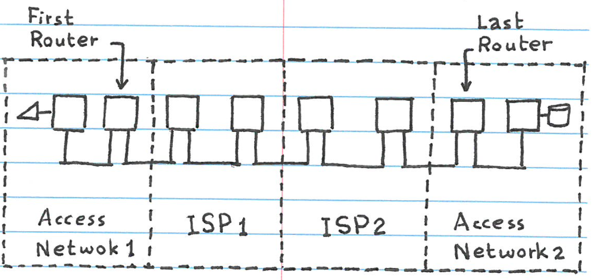

# Internet Service Providers (ISPs)

- To navigate a msg from a first router to a last router, the msg needs to go through a sequence of ISPs
- Each ISP is a set of inter-connected routers
- ISPs are organized in a tree of 3 levels

## ISP Tree

4 levels:

- L1: Tier 1 ISP
- L2: Regional ISPs
- L3: Local ISPs
- L4: Access Networks (ANs)

Lower levels (higher #) are **customers** to higher levels (lower #)

Higher levels (lower #) are **providers** to lower levels (higher #)

*Worst part of architecture from tiers: if one stops working, the ones below it go down*

**Solution:** Multiple copies of server boxes